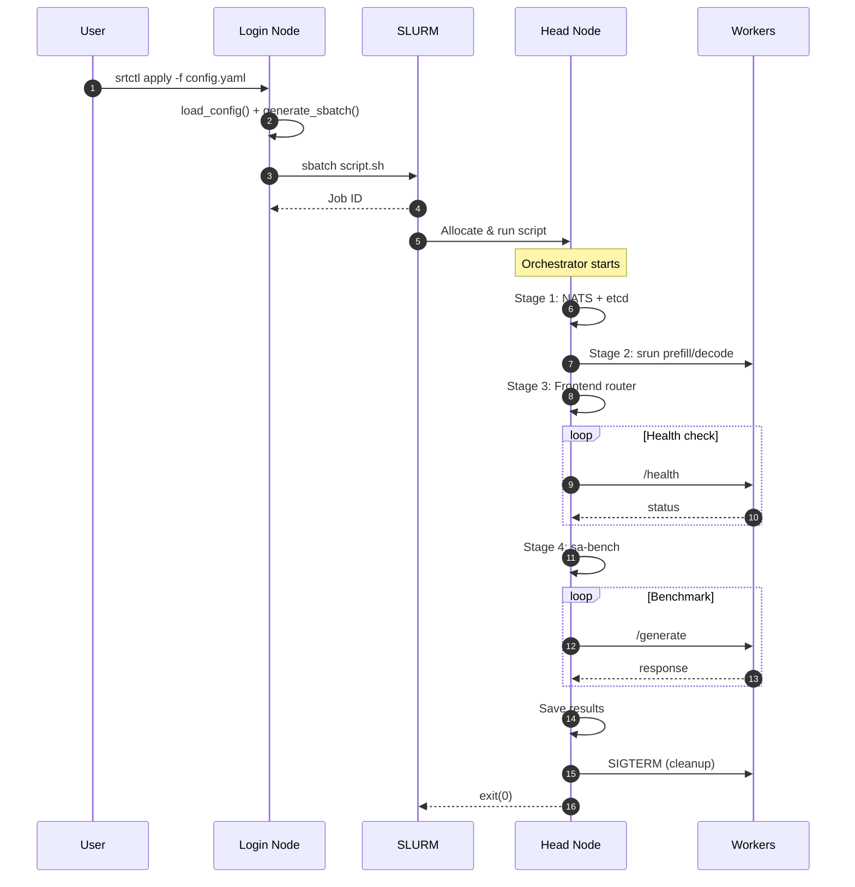

```mermaid
sequenceDiagram
    autonumber
    participant U as User
    participant L as Login Node
    participant S as SLURM
    participant H as Head Node
    participant W as Workers

    U->>L: srtctl apply -f config.yaml
    L->>L: load_config() + generate_sbatch()
    L->>S: sbatch script.sh
    S-->>L: Job ID
    S->>H: Allocate & run script
    
    Note over H: Orchestrator starts
    
    H->>H: Stage 1: NATS + etcd
    H->>W: Stage 2: srun prefill/decode
    H->>H: Stage 3: Frontend router
    
    loop Health check
        H->>W: /health
        W-->>H: status
    end
    
    H->>H: Stage 4: sa-bench
    
    loop Benchmark
        H->>W: /generate
        W-->>H: response
    end
    
    H->>H: Save results
    H->>W: SIGTERM (cleanup)
    H-->>S: exit(0)
```